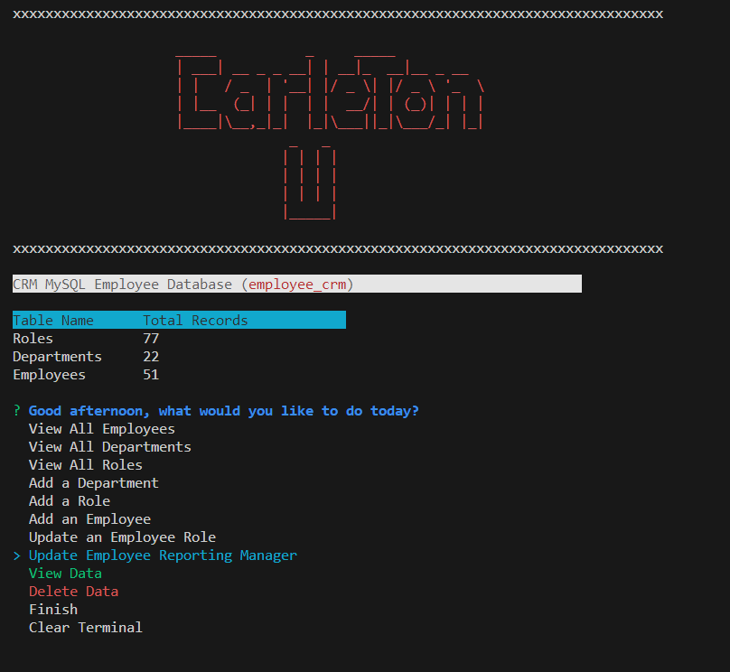
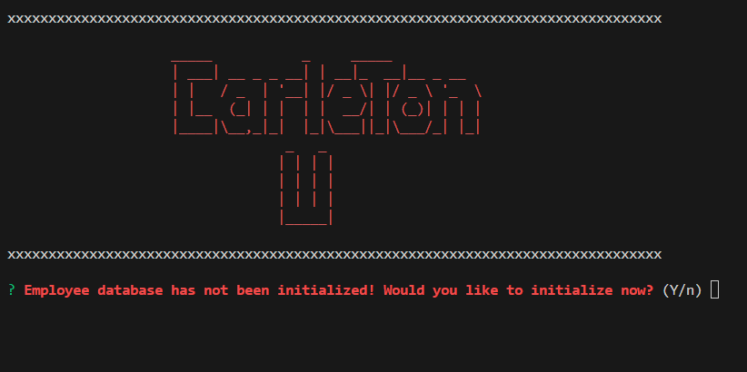
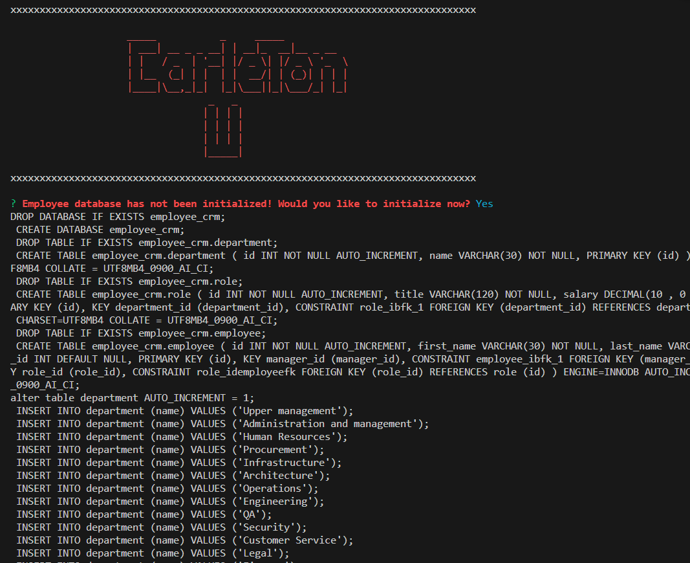
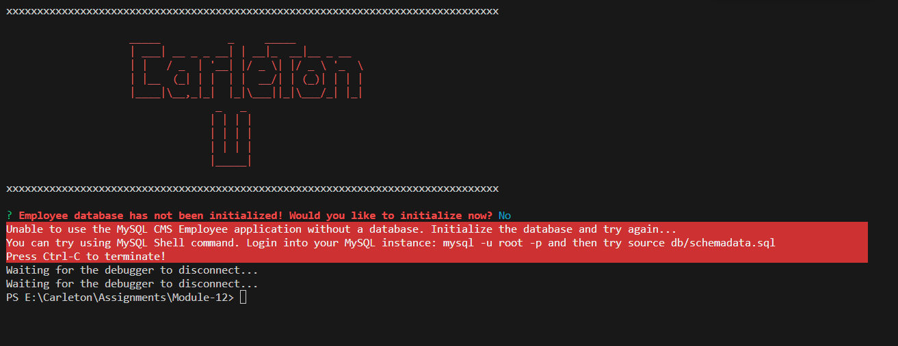

<a id="readme-top" name="readme-top"></a>

<p align="center"></p>

<p align="center" style="margin-top:25px; margin-bottom:50px;">
	<a href="https://developer.mozilla.org/en-US/docs/Web/javascript"></a>
	<a href="https://www.npmjs.com/package/inquirer"></a>
	<a href="https://www.npmjs.com/package/chalk"></a>
	<a href="https://www.mysql.com/products/workbench/"></a>
	<a href="https://en.wikipedia.org/wiki/MIT_License"></a>
</p>

# Carlton Coding Bootcamp Certification

<details style="margin-bottom: 25px; margin-top: 25px;">
	<summary>Table of Contents</summary>
	<ol>
		<li><a href="#Description">CMS Employee Tracker Description</a></li>
		<li><a href="#installation">Installation</a></li>
		<li><a href="#technology">Technology Stack</a></li>
		<li><a href="#database">Employee Database</a></li>
		<li><a href="#usage">Application Usage</a></li>
		<li><a href="#contactme">Questions? Contact Me!</a></li>
		<li><a href="#license">License</a></li>
	</ol>
</details>
<div id="Description" style="margin-top: 25px;">

## CMS Employee Tracker

As we advance in our training, we learn new skills and technology. This week is all about SQL - MySQL. Based on the assignments description we have this challenge. Developers frequently have to create interfaces that allow non-developers to easily view and interact with information stored in databases. These interfaces are called **content management systems (CMS)**. Your assignment this week is to build a command-line application from scratch to manage a company's employee database, using Node.js, Inquirer, and MySQL.

Once again, we are building a CLI application using NPM packages, such as Inquirer, Dotenv and Oracle MySQL2 which offers a Promise in return. The data as expected will reside in a MySQL database. Data contains already Employees, Departments and Roles that have somehow a normal configuration as in any organization.

The CMS Employee Tracker database was created in MySQL Server, using MSQY Workbench, but I have included a script that creates the database in case required. The initial database will not have any data; there is no seeding scripts. Once again

Here is my product!

<div style="margin-top: 15px;">
	
</div>
</div>

<p align="center" style="padding-left:30px;padding-right:30px;">
Most of times it is easier to have a better understanding when there is a video available. Here is a video presentation of the application:<br/> <a href="https://drive.google.com/file/d/1YX4-iefP5y1DwdvozFeABusSuwY1bOmJ/view?usp=sharing">https://drive.google.com/file/d/1YX4-iefP5y1DwdvozFeABusSuwY1bOmJ/view?usp=sharing</a>
</p>

<p align="right">(<a href="#readme-top">back to top</a>)</p>

<div id="installation" style="margin-bottom: 20px;margin-top: 20px;">

## Installation

1. Install Node 18 or later. You can use the package managerof your choice.
   Tests need to pass in Node 18 and 20.
2. Clone this repository : `git clone git@github.com:gusmiller/CMS-Database.git`
3. Run `npm i` to install the dependencies.
4. Run `npm start` to start the badge server and the frontend dev server.
5. When you run the application for the first time, database will be creaed.

**Important Note**: you must have MySQL installed and configured in your computer, you will need a root user and a regular user, as we workbench installed. MySQL is developed by Oracle you can download a free version from their [website](https://dev.mysql.com/doc/mysql-installation-excerpt/5.7/en/). To install MySQL follow this [installation guide](https://coding-boot-camp.github.io/full-stack/mysql/mysql-installation-guide). You will also need to install [npm dotenv](https://www.npmjs.com/package/dotenv), Dotenv is a zero-dependency module that loads environment variables from a .env file into process.env.

Once again we are using **inquirer** to create a **CLI terminal application**. We are combining the power of inquirer with Inquirer. We are also using a couple more libraries one of them will help us with the environment variables, which will protect our passwords and username.

Once you have completed the configuration of MySQL then you can run manually the db/schema.sql -which contains NO data, or use the db/schemadata.sql which already contains data. Names used in this file a fake names obtained from [https://1000randomnames.com/](https://1000randomnames.com/) website. None are real other than my name Gustavo Miller. You can also trigger the following command to initialize the databse (with data):

```
	mysql -u root -p
	source db/schemadata.sql
	source db/schema.sql
```

Dependancies included in the package.json:

```
	chalk version 4.1.2
	dotenv version 16.3.1
	inquirer version 8.2.4
	mysql2 version 2.2.5
```
</div>

<p align="right">(<a href="#readme-top">back to top</a>)</p>

<div id="technology" style="margin-top: 25px;">

## Technology Stack

The following should list any major frameworks/libraries used to in the designing and coding of **CMS Employee Tracker application**.
This section  bootstrap your project. Leave any add-ons/plugins for the acknowledgements section. Here are a few examples.

* <a href="https://www.npmjs.com/package/chalk"></a> Make message colorful and pleasing to the eye
* <a href="https://www.mysql.com/products/workbench/"></a> MySQL Workbench application
* <a href="https://www.npmjs.com/package/dotenv"></a> Dotenv environment variables
* <a href="https://www.npmjs.com/package/inquirer"></a> Inquiere library to build interactive questionnaire applications
* <a href="https://www.tsql.info/"></a> Transac-SQL language to retrieve data from database - JOIN queries, Nested and aggregate queries 
* <a href="https://developer.mozilla.org/en-US/docs/Web/javascript"></a> Use Javascript as the main language - used classes and module exports.

<div id="database" style="margin-top: 25px;">

## Employee database

The Employee database - hosted on <span style="color:cyan">Oracle MySQL</span> is relatively simple, it contains 3 tables implemented with simple relationships to ensure data integrity. Also known as referential integrity. Tables and fields have been created using standing naming conventions. Primary keys are using in this case autoincremental numeric fields.

The following image shows the database model for the Employee Database:

<div style="margin-right:30px;margin-top: 15px;">
	<p align="center"></p>
</div>

All queries that produce a dataset are shown formatted in columns with desire columns. User can clear screen or keep the previous results. Here are a couple of examples with real data:

<div style="margin-top: 15px;">
	
</div>

<details style="margin-bottom: 25px; margin-top: 25px;"> 
	<summary>Budget Total grouped by Department and Detailed report. <span style="green">Click here to expand</span> <br/>For management -and even for personal use, it is important to see how money is spent. SQL language allows us to retrieve data in as simple or complex depending on the needs. </summary>

<div style="margin-top: 15px;">
	
</div>

</details>

<div id="usage" style="margin-top: 25px;">

## Application Usage

The application is very simple and easy to use. User will be presented with a number of predefined options from where they can decide which data to retrieve from database. Database is initialized and seeded with fake names, department names, and roles, to mimic a real corporation organization. It is critical and part of a database design that we prevent data duplication. Therefore, when creating new departments, roles or employee's profiles, the application will validate whether this information already exists or not, Proper message will be displayed to the user in case information already exist.

But first we need a database. Read the following section to review how database is created.

### Database Intialization

The CMS Employee Tracker requires the CMS Employee database to be initialized before it can be used. I have provided scripts that can run from the MySQL Shell or MySQL Workbench, but the application database can be generated on the 'fly'. This allows inexperienced users to use the application when they launch it for the first time. When launching application for the first time, it performs a database validation -make sure database exists (which it won't). These are the database validation, initialization and seeding:

<details style="margin-bottom: 25px; margin-top: 25px;"> 
	<summary>1. Application attempst to open database and it will not find it.</summary>
<p align="center"></p>
</details>
<details style="margin-bottom: 25px; margin-top: 25px;"> 
	<summary>2. Application will generate Database, Tables and Seed tables.</summary>
<p align="center"></p>
</details>
<details style="margin-bottom: 25px; margin-top: 25px;"> 
	<summary>3. In case user decides NOT to create database process will terminate. Application cannot be accessed without a database.</summary>
<p align="center"></p>
</details>

### Options available

User will be able to browse information add information and delete information from database. All information retrieved from the database will be formatted and displayed on the screen.

The current application contains the following questions:

<ul>
	<li>Good Morning/Afternoon, what would you like to do today?</li>
	<li>View All Employees
	<li>View All Departments
	<li>View All Roles
	<li>View Data <span style="color:Cyan">(Bonus)</span></li>
	<ul>
		<li>Employees by Manager</li>
		<li>Employees by Managers (ALL)</li>
		<li>Employees by Department</li>
		<li>Departments Budget</li>
	</ul>
	<li>Delete Data <span style="color:Cyan">(Bonus)</span></li>
	<ul>
		<li>Delete Roles!</li>
		<li>Delete Departments</li>
		<li>Delete Employee</li>
	</ul>	
	<li>Add a Department</li>
	<ul>
		<li>Please enter Name of Department you like to add</li>
	</ul>
	<li>Add a Role</li>
	<ul>
		<li>Please enter Role name to add</li>
		<li>Please enter Role's base Salary</li>
		<li>Please enter Name of Department</li>
	</ul>
	<li>Add an Employee</li>
	<ul>
		<li>Please enter Employee's First name to add</li>
		<li>Please enter Last name to add</li>
		<li>Please enter what would be their Role</li>
		<li>Who will be their manager?</li>
	</ul>
	<li>Update Employee's Role</li>
	<ul>
		<li>Select the Employee you like to update?</li>
		<li>Select the new Role for the selected Employee?</li>
	</ul>
	<li>Finish</li>
	<li>Clear Terminal</li>
</ul>

### Data Validation and Flow
As mentioned before validations are important in a CMS Employee database. The application does all sorts of validations. Taking the Roles as an example: We are promoting an employee to a new Role. Application should allow user to change employee's current Role to a new one -the promoted Role. These are the application steps in the process:

<details style="margin-bottom: 25px; margin-top: 25px;"> 
	<summary>1. Select option to update Employee's Role from the dropdown list.</summary>
<p align="center"></p>
</details>
<details style="margin-bottom: 25px; margin-top: 25px;"> 
	<summary>2. Select from list of Employee's who is up for promotion.</summary>
<p align="center"></p>
</details>
<details style="margin-bottom: 25px; margin-top: 25px;"> 
	<summary>3. Select from list of Roles the new Role to be assigned. Notice! The current Role is NOT included in the list, we are not promoting an Employee to current role.</summary>
<p align="center"></p>
</details>
<details style="margin-bottom: 25px; margin-top: 25px;"> 
	<summary>4. New Role is assigned to the Employee!</summary>
<p align="center"></p>
<p align="center">Congratulations! you may now proceed in taking Employee for dinner!</p>
</details>

<span style="background-color:#A1CAF1;color:black;">Note: at all the time user has a way to cancel a request. In case user has made a mistake or decides not to proceed, look for the "cancel" option in the dropdown list.</span>

<p align="right">(<a href="#readme-top">back to top</a>)</p>

</div>

<div id="contactme" style="margin-top: 25px;">

## Questions? Contact Me 

The purpose of this CMS Employee Tracker is to help developers create their project Readme.md file that is required for ALL projects. Over time this application can save the developer lots of time, as this is a tedious process. The CMS Employee Tracker can be enhanced and there is growth for much more.

Do not hesitate in contacting me, Gustavo Miller - gustavo.miller@miller-hs.com.

You may find the application at: https://github.com/gusmiller/CMS-Database/blob/main/README.md

<p align="right">(<a href="#readme-top">back to top</a>)</p>

</div>

<div id="license" style="margin-top: 25px;">

## License

MIT License

Copyright (c) 2023 CMS Employee Tracker

Permission is hereby granted, free of charge, to any person obtaining a copy of this software and associated documentation files (the "Software"), to deal in the Software without restriction, including without limitation the rights to use, copy, modify, merge, publish, distribute, sublicense, and/or sell copies of the Software, and to permit persons to whom the Software is furnished to do so, subject to the following conditions:

The above copyright notice and this permission notice shall be included in all copies or substantial portions of the Software.

THE SOFTWARE IS PROVIDED "AS IS", WITHOUT WARRANTY OF ANY KIND, EXPRESS OR IMPLIED, INCLUDING BUT NOT LIMITED TO THE WARRANTIES OF MERCHANTABILITY, FITNESS FOR A PARTICULAR PURPOSE AND NONINFRINGEMENT. IN NO EVENT SHALL THE AUTHORS OR COPYRIGHT HOLDERS BE LIABLE FOR ANY CLAIM, DAMAGES OR OTHER LIABILITY, WHETHER IN AN ACTION OF CONTRACT, TORT OR OTHERWISE, ARISING FROM, OUT OF OR IN CONNECTION WITH THE SOFTWARE OR THE USE OR OTHER DEALINGS IN THE SOFTWARE.

<a href="https://en.wikipedia.org/wiki/MIT_License"></a>

<p align="right">(<a href="#readme-top">back to top</a>)</p>

</div>

---
© 2023 edX Boot Camps LLC. Confidential and Proprietary. All Rights Reserved. Developed by Gustavo Miller.
